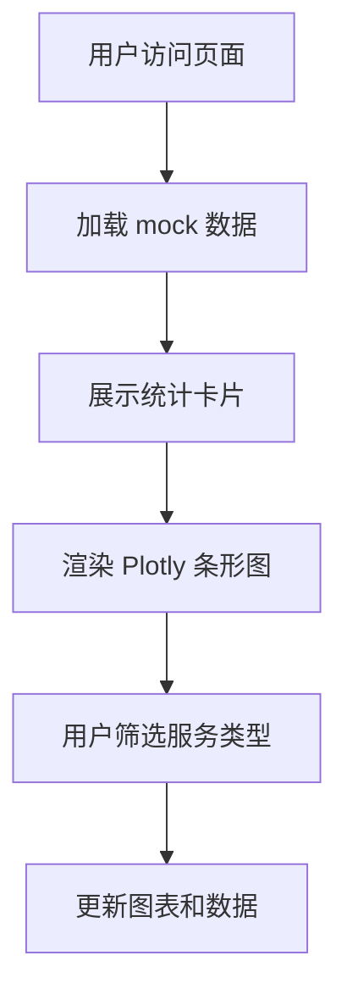

## 1. 产品概述
服务响应时效监控页面 - 使用 Streamlit + Plotly 展示各服务类型的平均响应时间
- 解决服务性能监控和可视化展示问题，面向运维和技术管理人员
- 提供直观的条形图展示，支持快速识别性能瓶颈

## 2. 核心功能

### 2.1 功能模块
1. **服务响应时效页面**: 服务类型选择器、平均响应时间条形图、数据统计卡片

### 2.2 页面详情
| 页面名称 | 模块名称 | 功能描述 |
|----------|----------|----------|
| 服务响应时效页面 | 侧边栏过滤器 | 服务类型筛选、时间范围选择 |
| 服务响应时效页面 | 数据统计卡片 | 展示总服务数、平均响应时间、最快/最慢服务 |
| 服务响应时效页面 | 条形图可视化 | 使用 Plotly 展示各服务平均响应时间，支持交互 |
| 服务响应时效页面 | 数据表格 | 展示详细的服务响应时间数据 |

## 3. 核心流程
用户访问页面后自动加载 mock 数据，可通过侧边栏筛选服务类型，查看可视化图表和详细数据。

## 4. 用户界面设计

### 4.1 设计风格
- 主色调：科技蓝 (#2563EB) 配合 Streamlit 默认主题
- 卡片风格：圆角卡片，轻微阴影
- 字体：系统默认无衬线字体
- 布局：侧边栏 + 主内容区布局
- 图表：Plotly 交互式条形图，支持悬停显示详情

### 4.2 页面设计概览
| 页面名称 | 模块名称 | UI 元素 |
|----------|----------|---------|
| 服务响应时效页面 | 统计卡片 | 4 个指标卡片，图标 + 数值 + 标签 |
| 服务响应时效页面 | 条形图 | 横向条形图，颜色渐变，支持排序和缩放 |
| 服务响应时效页面 | 数据表格 | 可排序表格，显示服务名、响应时间、状态 |

### 4.3 响应式
Streamlit 自适应布局，桌面端优先，移动端自动调整

### 4.4 数据说明
- 使用 mock 数据，包含 10-15 个服务类型
- 响应时间范围：50ms - 2000ms
- 服务类型示例：API 网关、数据库、缓存服务、认证服务、文件服务等
