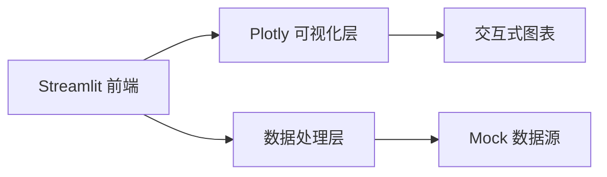

## 1. 架构设计



## 2. 技术描述
- 前端：Streamlit + Plotly
- 初始化方式：直接运行 Python 脚本
- 后端：无（纯前端展示，使用 mock 数据）
- 数据：Python 内建数据结构模拟

## 3. 路由定义
| 路由 | 说明 |
|------|------|
| / | 主页面，展示服务响应时效分析 |

## 4. 数据结构

### 4.1 服务数据模型
```python
class ServiceData:
    service_name: str      # 服务名称
    service_type: str      # 服务类型
    avg_response_time: float  # 平均响应时间 (ms)
    request_count: int     # 请求数量
    status: str           # 服务状态 (正常/警告/异常)
```

### 4.2 Mock 数据
包含 12 个服务类型的模拟数据，覆盖常见的服务类型。

## 5. 组件架构

### 5.1 页面组件
- 侧边栏：过滤器和配置
- 统计卡片区：关键指标展示
- 图表区：Plotly 条形图
- 数据表区：详细数据表格

### 5.2 可视化配置
- 图表类型：横向条形图 (bar chart)
- 颜色方案：根据响应时间使用渐变色谱
- 交互功能：悬停提示、缩放、平移
- 排序：支持按响应时间升序/降序
